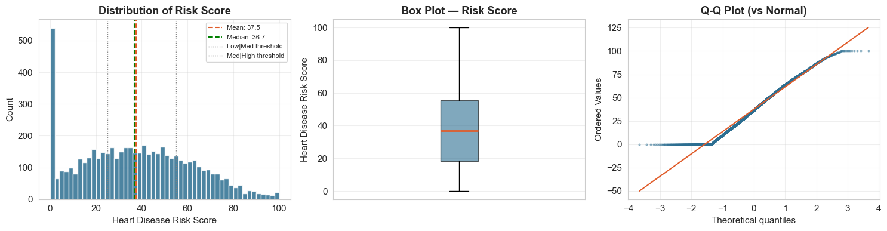
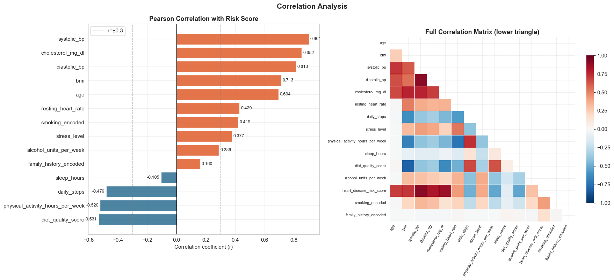
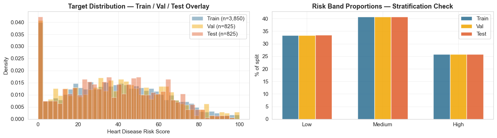
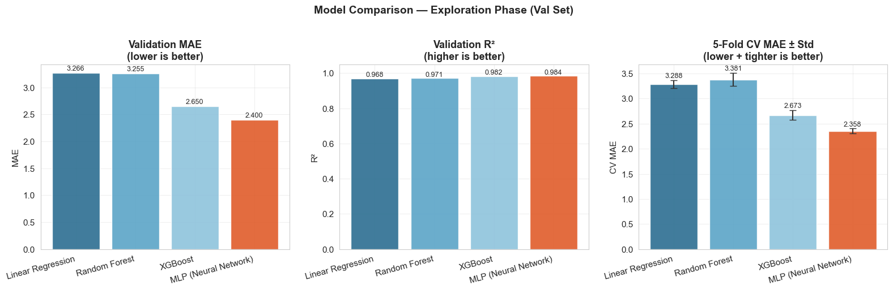
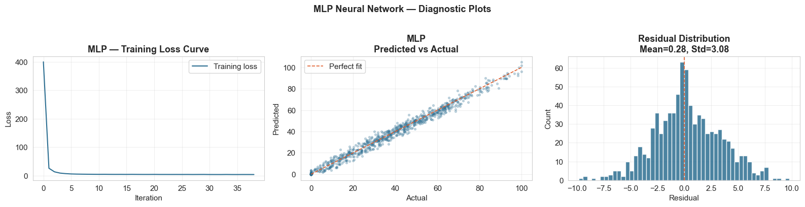
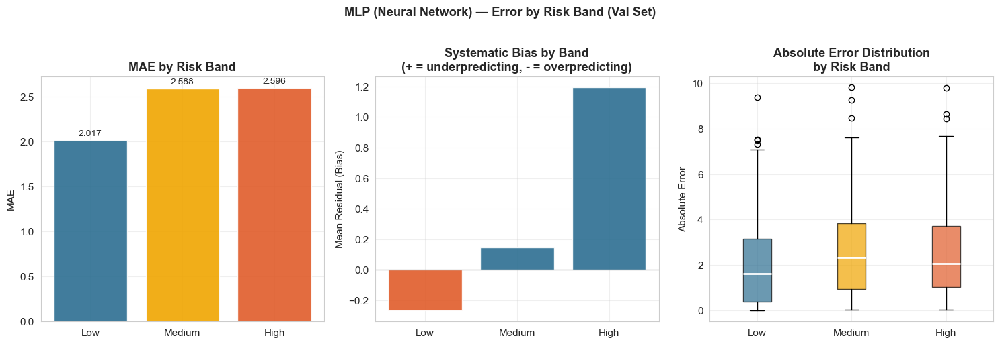
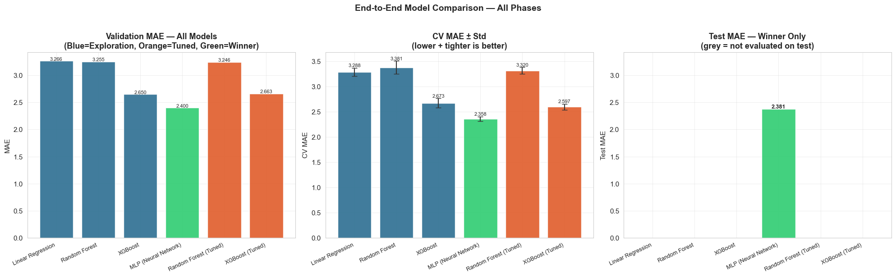
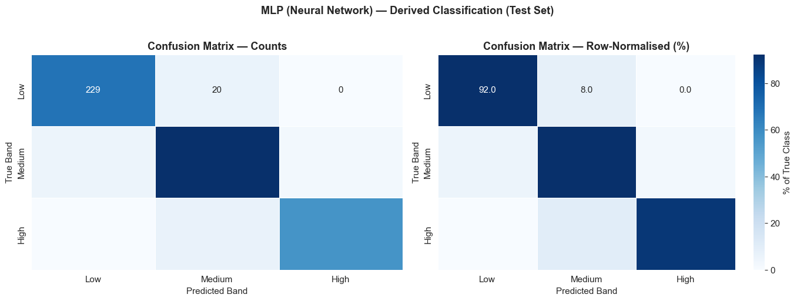
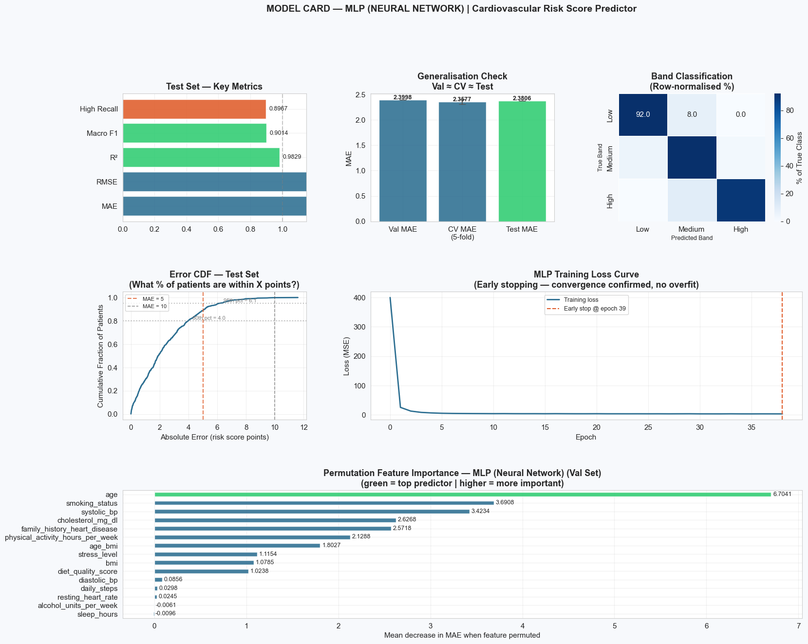

# Cardiovascular Risk Score Prediction

**Predict a continuous cardiovascular risk score (0–100) from 15 patient features using an end-to-end ML pipeline. Secondary task: classify patients into risk bands (Low / Medium / High) via derived thresholds.**
---

## Table of Contents
1. [Project Overview](#project-overview)
2. [Repository Structure](#repository-structure)
3. [Dataset](#dataset)
4. [Environment Setup](#environment-setup)
5. [How to Run](#how-to-run)
6. [Notebook Structure](#notebook-structure)
7. [Exploratory Data Analysis](#exploratory-data-analysis)
8. [Data Preparation](#data-preparation)
9. [Model Exploration & Selection](#model-exploration--selection)
10. [Error Analysis](#error-analysis)
11. [Final Results](#final-results)
12. [Key Design Decisions](#key-design-decisions)
13. [Agent Tooling](#agent-tooling)
14. [References](#references)

---

## Project Overview

| Item | Detail |
|------|--------|
| **Problem type** | Regression (primary) + derived classification |
| **Target variable** | `heart_disease_risk_score` (continuous, 0–100) |
| **Dataset** | Cardiovascular Risk Dataset — 5,500 patients, 15 features |
| **Final model** | MLP Neural Network |
| **Test MAE** | 2.3806 |
| **Test R²** | 0.9829 |
| **Macro F1 (bands)** | 0.9014 |
| **High-risk Recall** | 0.8967 |
| **Split** | 70% train / 15% val / 15% test — stratified by risk band |

---

## Repository Structure

```
cardiovascular-risk-prediction/
├── cardiovascular_risk_prediction.ipynb   
├── cardiovascular_risk_dataset.csv      
├── requirements.txt
├── project_report.pdf                       
├── README.md                            
├── images/                                
│   ├── img_01_target_distribution.png
│   ├── img_02_correlation_heatmap.png
│   ├── img_04_stratification_check.png
│   ├── img_05_mlp_diagnostics.png
│   ├── img_06_model_comparison.png
│   ├── img_09_error_by_band.png
│   ├── img_11_confusion_matrix.png
│   ├── img_12_endtoend_comparison.png
│   └── img_13_model_card.png
└── appendix/
    ├── Session_Log.pdf
```

---

## Dataset

**File:** `cardiovascular_risk_dataset.csv`
**Rows:** 5,500 | **Columns:** 17 (15 features + 1 target + 1 dropped)

| Column | Type | Notes |
|--------|------|-------|
| `heart_disease_risk_score` | float (0–100) | **Target variable** |
| `risk_category` | categorical | Dropped — algorithmic bucketing of target (leakage) |
| `Patient_ID` | integer | Dropped — identifier only |
| `systolic_bp`, `diastolic_bp` | numeric | Strongest predictors (r=0.901, r=0.813) |
| `cholesterol_mg_dl` | numeric | r=0.852 with target |
| `smoking_status` | ordinal | Never / Former / Current → encoded 0/1/2 |
| `family_history_heart_disease` | binary | No/Yes → encoded 0/1 |
| `alcohol_units_per_week` | numeric | Right-skewed — Winsorised at 99th pct for linear pipeline |
| `age_bmi` | engineered | age × bmi interaction (r=0.838) — tree pipeline only |

**No missing values. No duplicates.**

---

## Environment Setup

### Option 1 — pip (recommended)

```bash
# 1. Clone or download the repository
git clone <repo-url>
cd cardiovascular-risk-prediction

# 2. Create a virtual environment (Python 3.12)
python -m venv venv
source venv/bin/activate          # macOS/Linux
venv\Scripts\activate             # Windows

# 3. Install dependencies
pip install -r requirements.txt
```

### Option 2 — conda

```bash
conda create -n cv-risk python=3.12
conda activate cv-risk
pip install -r requirements.txt
```

### Verify installation

```bash
python -c "import pandas, numpy, sklearn, xgboost, statsmodels; print('All packages OK')"
```

---

## How to Run

```bash
jupyter notebook cardiovascular_risk_prediction.ipynb
```

Then **run all cells in order** (`Kernel → Restart & Run All`).

> ⚠️ **Important:** The test set evaluation cell (Cell 106) is designed to be run **once only**. Re-running after seeing results would constitute implicit data leakage into model selection decisions.

### Expected runtime

| Section | Approximate time |
|---------|-----------------|
| Steps 1–3 (EDA + Preprocessing) | ~1–2 min |
| Step 4 (Model Exploration, 4 models + CV) | ~3–5 min |
| Step 5 — XGBoost tuning (60 iter × 5 folds) | ~4–6 min |
| Step 5 — RF tuning (40 iter × 5 folds) | ~4–6 min |
| Step 5 — Test evaluation + Step 6 | ~2–3 min |
| **Total** | **~15–20 min** |

---

## Notebook Structure

| Step | Cells | Description |
|------|-------|-------------|
| **Step 1** | 1–2 | Problem framing: target definition, metrics, assumptions |
| **Step 2** | 3–28 | EDA: distributions, outliers, correlations, boundary region analysis |
| **Step 3** | 29–55 | Preprocessing: encoding, age_bmi engineering, VIF, stratified split, pipelines, leakage guards |
| **Step 4** | 56–77 | Model exploration: Linear Regression, Random Forest, XGBoost, MLP |
| **Step 5** | 78–114 | Tuning, error analysis (6 sub-sections), test evaluation, three-way comparison |
| **Step 6** | 115–121 | Final model selection rationale, limitations, model card |

---

## Exploratory Data Analysis

### Target Distribution

The target `heart_disease_risk_score` spans 0–100 with a roughly uniform distribution and mild right skew (skew=0.21). Mean=37.5, Median=36.7. The Q-Q plot confirms the score is not normally distributed — justifying non-parametric models over purely linear ones. The two dotted lines mark the classification thresholds (25 and 55) that define Low/Medium/High bands.



---

### Feature Correlations

`systolic_bp` (r=0.901), `cholesterol_mg_dl` (r=0.852), and `diastolic_bp` (r=0.813) are the dominant risk predictors. Protective factors include `diet_quality_score` (r=−0.531) and `physical_activity_hours_per_week` (r=−0.520). The full correlation matrix reveals multicollinearity between the blood pressure pair — addressed by dropping `diastolic_bp` from the linear pipeline after VIF analysis confirmed `systolic_bp` VIF=11.2.



---

## Data Preparation

### Stratification Verification

The 70/15/15 split was stratified by risk band. The right panel confirms Low (~33%), Medium (~41%), and High (~25%) proportions are identical across train, val, and test — no accidental class skew in evaluation. The overlapping density curves (left) confirm the splits share the same underlying score distribution.



---

## Model Exploration & Selection

### All Four Models Compared

Four models were trained in Step 4 using a consistent 5-fold CV harness. MLP consistently outperformed all candidates on every metric simultaneously — a clean, unambiguous result.



> MLP wins across all three panels: lowest Val MAE (2.400), highest Val R² (0.984), lowest CV MAE (2.358) with the tightest error bars (CV Std=0.046). XGBoost — the other strong candidate — was 10% worse on CV MAE (2.673) with twice the variance (0.094). Tuned XGBoost and RF (Step 5) still did not close this gap.

---

### MLP Training Behaviour

The loss curve shows rapid convergence in the first 5 epochs with a clean plateau thereafter. Early stopping triggered at epoch 39 — well before the 500-iteration limit — confirming the model learned without overfitting. The predicted vs actual scatter tracks the diagonal tightly across the full 0–100 range. Residuals are centred near zero (Mean=0.28, Std=3.08) with no visible patterns.



---

## Error Analysis

### Error by Risk Band

Low-risk patients are predicted most accurately (MAE=2.017). Medium and High bands show slightly elevated MAE (~2.59) — largely attributable to patients near the classification boundaries. The systematic bias panel shows High-risk patients are marginally underpredicted (+1.20 mean residual), a structural property when predictions cluster near the 55-point threshold. The error distribution by band (right) shows comparable spread across all three — no band is systematically worse.



---

## Final Results

### End-to-End Model Comparison — All Phases

The chart below summarises all 6 models across exploration, tuning, and test phases. MLP (green) is the only model with a bar in the Test MAE panel — evaluated exactly once on the held-out test set. All other models show grey bars, confirming the test set was never touched during model selection.



---

### Confusion Matrix — Test Set (Derived Classification)

Applying confirmed thresholds (Low: 0–24.9, Medium: 25–54.9, High: 55–100) to MLP's continuous predictions on 825 held-out patients:



| Band | Precision | Recall | F1 | Support |
|------|-----------|--------|----|---------|
| Low | 0.93 | 0.83 | 0.88 | 276 |
| Medium | 0.88 | 0.92 | 0.90 | 336 |
| **High** | **0.96** | **0.90** | **0.93** | 213 |
| **Macro avg** | **0.92** | **0.88** | **0.90** | 825 |

Zero Low→High or High→Low misclassifications. All errors occur at adjacent band boundaries — consistent with the structural boundary region (±5 of thresholds) identified in EDA.

---

### Model Card

The full model card below summarises test metrics, the three-way generalisation check, band classification heatmap, error CDF, training loss curve, and MLP permutation feature importances in a single view.



**Three-way generalisation check:** Val MAE 2.3998 ≈ CV MAE 2.3577 ≈ Test MAE 2.3806 — all gaps <0.05. Confirms the model generalises and the validation set was not implicitly overfit during selection.

**Permutation importance note:** MLP has no intrinsic feature importances. Permutation importance on the val set reveals `age` (6.70) as the top predictor — diverging from tree-based MDI rankings where `systolic_bp` leads. This reflects MLP's learned interaction structure rather than split-based salience.

**Error CDF:** 80% of test patients are predicted within ~4 risk score points. The 95th percentile error is ~7 points — well within clinically manageable range for a screening tool.

---

### Final Test Set Metrics

| Metric | Value |
|--------|-------|
| MAE | **2.3806** |
| RMSE | **3.0873** |
| R² | **0.9829** |
| Macro F1 (derived bands) | **0.9014** |
| High-risk Recall | **0.8967** |
| High-risk Precision | **0.9598** |
| High-risk F1 | **0.9272** |

---

## Key Design Decisions

| Decision | Choice | Rationale |
|----------|--------|-----------|
| Task type | Regression (primary) | `risk_category` is algorithmic bucketing of score — predicting it = learning an if-else rule |
| `risk_category` | Dropped entirely | Direct leakage of target variable |
| Feature engineering | `age_bmi` interaction | r=0.838 with target, outperforms age (0.694) and bmi (0.713) individually |
| `age_bmi` scope | Tree pipeline only | VIF=61.3 — unsafe for linear models |
| `alcohol_units_per_week` | Winsorised at 99th pct | 3.9% outliers — real population values, not errors |
| CV strategy (tuning) | KFold(5) | StratifiedKFold incompatible with continuous targets in RandomizedSearchCV |
| CV strategy (exploration) | StratifiedKFold(5) | Manual fold loop — ensures stable risk band distributions across folds |
| Winner model | MLP (Neural Network) | Outperforms all candidates on every metric; holds on held-out test set |
| MLP inputs | `X_train_tree_scaled` | MLPs require scaled inputs — StandardScaler fitted on training data only (no leakage) |

---


## References

- Mitchell, M. et al. (2019). *Model Cards for Model Reporting*. Proceedings of the ACM Conference on Fairness, Accountability, and Transparency.
- Pedregosa, F. et al. (2011). *Scikit-learn: Machine Learning in Python*. JMLR 12, pp. 2825–2830.
- Chen, T. & Guestrin, C. (2016). *XGBoost: A Scalable Tree Boosting System*. KDD '16.

---

*MSIN0097 — Predictive Analytics | UCL MSc Business Analytics 2025–26 | Submission deadline: 03 March 2026*
